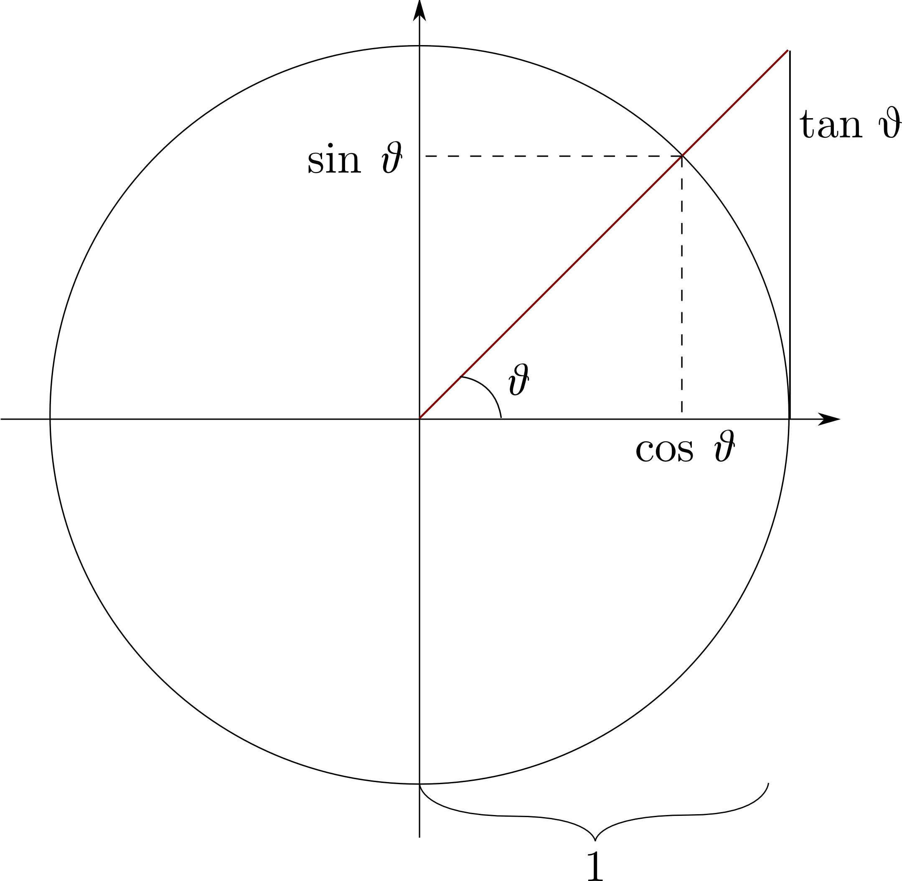

# Trigonometry

Trigonometry is necessary in part for problems that focus on angles. Projectile launch angles, force angles, light incidence angles, etc.

At its most basic, trigonometry describes the relationship between angles and distances. The main diagram useful to explain it is a circle of radius 1, a *unit circle*, with a horizontal line through its center. The angle goes counterclockwise, from the right half of this line, to another line emanating from the center point.

In this diagram:
$$
\begin{align}
x &= \cos\theta \\
y &= \sin\theta \\
\frac{y}{x} &= \frac{\sin\theta}{\cos\theta} = \tan\theta
\end{align}
$$
So for any given angle $\theta$, you can calculate the $x$ component with $\cos\theta$, the $y$ component with $\sin\theta$, and the slope with $\tan\theta$.

So, why is this useful? I'll give an example. Imagine we know that a projectile has been launched with an inclination $\theta$ of $60\degree$, or $\frac{\pi}{3}\text{ rad}$, and an initial velocity of $|v| = 5\text{ m/s}$. If we are asked for its velocity in the form of a vector, how can we convert an angle and a magnitude into our vector? We use trigonometry:
$$
\begin{align}
\overrightarrow{v} &= \begin{bmatrix}\cos\theta\\\sin\theta\end{bmatrix}*|v| \\
\overrightarrow{v} &= \begin{bmatrix}\cos(\pi/3\text{ rad})\\\sin(\pi/3\text{ rad})\end{bmatrix}*5\text{ m/s} \\
\overrightarrow{v} &= \begin{bmatrix}0.5\\0.866\end{bmatrix}*5\text{ m/s} \\
\overrightarrow{v} &= \begin{bmatrix}2.5\\4.330\end{bmatrix}\text{ m/s}
\end{align}
$$
The easiest way I have found to memorize sine and cosine personally is remembering that, in the unit circle diagram, **cosine is horizontal and sine is vertical**. You can then rotate the diagram onto any needed use case and just consider the horizontal and vertical there.
